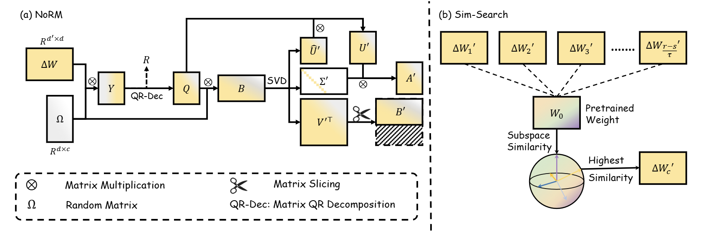
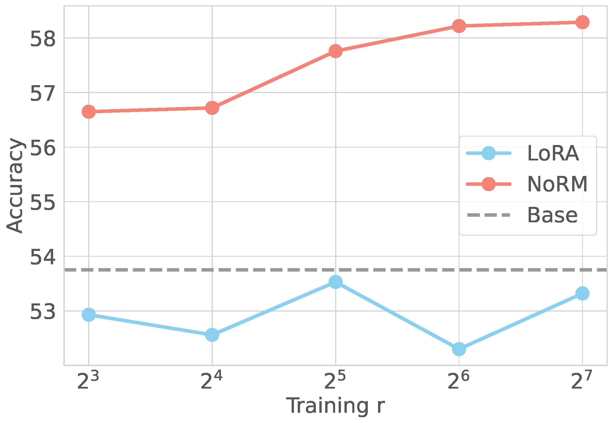
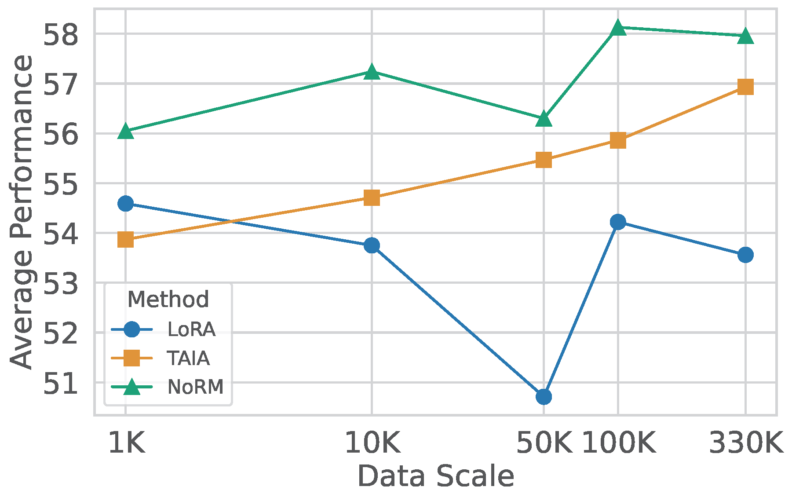

# FINE-TUNING WITH RESERVED MAJORITY FOR NOISE REDUCTION

<p align = "center">

</p>
<p align = "center">
The computation framework of NoRM and proposed Sim-Search method.
</p>

## News
🔥 [2025/01/23] Our paper is accepted by ICLR 2025!
* This is the repo for [FINE-TUNING WITH RESERVED MAJORITY FOR NOISE REDUCTION](https://openreview.net/pdf?id=ZV7CLf0RHK)


## Contents
- [FINE-TUNING WITH RESERVED MAJORITY FOR NOISE REDUCTION](#fine-tuning-with-reserved-majority-for-noise-reduction)
  - [News](#news)
  - [Contents](#contents)
  - [Highlights](#highlights)
  - [Setups](#setups)
    - [Install](#install)
    - [Data Preparation](#data-preparation)
  - [Finetuning](#finetuning)
    - [LoRA Finetuning](#lora-finetuning)
    - [Prepare NoRM Parameters](#prepare-norm-parameters)
    - [NoRM Evaluation](#norm-evaluation)
- [Citation](#citation)


## Highlights
* Our proposed **NoRM** as an simple-yet-effective method which can be applied to reduce LoRA parameter redundancies which natually exist during fine-tuning. The most supportive components are kept based on the highest subspace similarity with base models. With only contributable parameters maintained, 
* NoRM can leverage more tunable parameters which leads to higher performance improvements bounds. 
* NoRM can use small amount of SFT data with little distribution shift problems. It also benefits from the data scaling law as vanilla fine-tuning. 
* As NoRM keeps most advantageous components, it is intrinsically powerful than LoRA under continuous learning, where catastrophic forgetting problem accompany with distribution shift.  
  
| Model  | Order1 | Order2 | Order3 | Average |
|--------|--------|--------|--------|---------|
| LoRA   | 65.34  | 74.56  | 70.44  | 70.11   |
| NoRM   | **78.88**  | **80.08**  | **78.76**  | **79.24**   |


## Setups

### Install
1. First clone this repository and nagivate to the TAIA_LLM repository:
```bash
git clone https://github.com/pixas/NoRM.git
cd NoRM
```

2. Install Package
   
```bash
conda create -n norm python=3.10
conda activate norm
conda install --yes --file requirements.txt
pip install flash-attn --no-build-isolation
```

### Data Preparation
We use the following data format:
```python
{
  "conversations": [
    {"from": "human", "value": ""},
    {"from": "gpt", "value": ""}
  ],
  "answer": "" # for evaluation dataset
}
```


## Finetuning
We here use `Llama3-8B` model as the example backbone. You can change the backbone to any other chat-models and prepare corresponding chat templates.
### LoRA Finetuning
```bash
bash scripts/train/bash/sft_lora_r64_llama38b_format.sh
```
Replace the backbone model path, output path, and data path in the script with the actual path in your machine.
This script automatically evaluate vanilla LoRA's performance until the training completes by detecting whether the `adapter_config.json` exists in the output path.

### Prepare NoRM Parameters
```bash
sbatch scripts/autoselect.sh
```
If using local machines, run the following command:
```bash
python evaluation/auto_select.py \
  --model_base $MODEL_BASE \
  --model_path $MODEL_PATH \
  --save_name ${SAVE_NAME} \
  --step ${step} \
  --select_method ${select_method} \
  --range_start ${range_start}
```
where 
`MODEL_BASE`: the base model path
`MODEL_PATH`: the original LoRA fine-tuning path
`SAVE_NAME`: the generated NoRM parameter filename, which will be saved as `${MODEL_PATH}/${SAVE_NAME}.safetensors`.
`step`: default to 0.1, as the search step in Sim-Search
`select_method`: default to lora`
`range_start`: default to 1


### NoRM Evaluation
Use the following command to conduct evaluation:
```bash
sbatch scripts/eval/slurm/eval_parallel_peft_batch_autoselect.sh $TASK_PATH $MODEL_BASE $MODEL_PATH ${CKPT}-automerge-${SAVE_NAME} ${LOGS_BASE_PATH} $domain $SAVE_NAME
```
where
`domain`: the evaluation dataset's name in your local folder
`LOGS_BASE_PATH`: the log file base path, default to `./logs/training_data_name/`

Check the file `./logs/training_data_name/${CKPT}-automerge-${SAVE_NAME}/$domain/eval.log` for evaluation results.


# Citation
If you find NoRM useful for your research and applications, please cite using this BibTeX:

```bibtex
@inproceedings{jiang2025finetuning,
title={Fine-tuning with Reserved Majority for Noise Reduction},
author={Shuyang Jiang and Yusheng Liao and Yanfeng Wang and Ya Zhang and Yu Wang},
booktitle={The Thirteenth International Conference on Learning Representations},
year={2025},
url={https://openreview.net/forum?id=ZV7CLf0RHK}
}
```